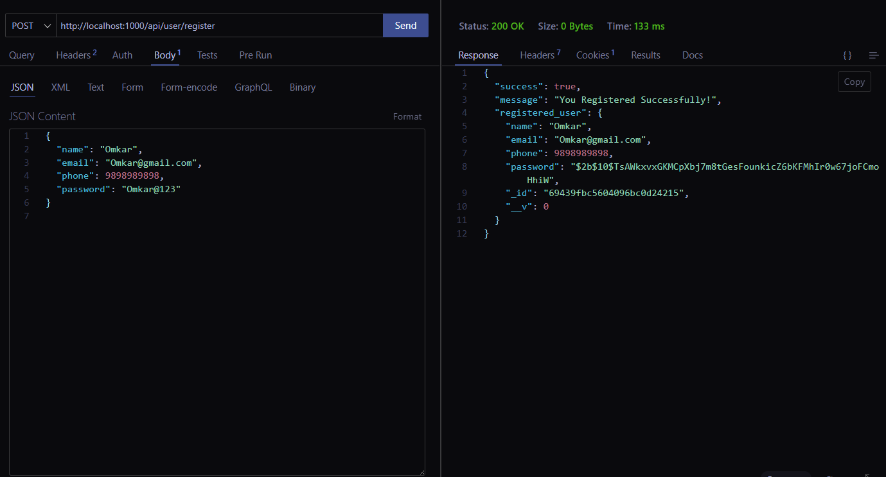
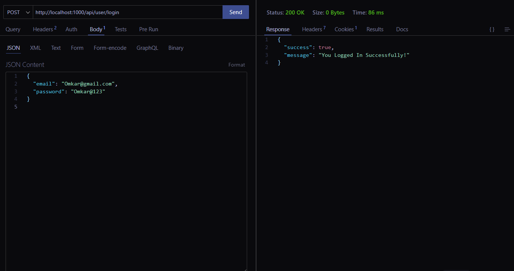
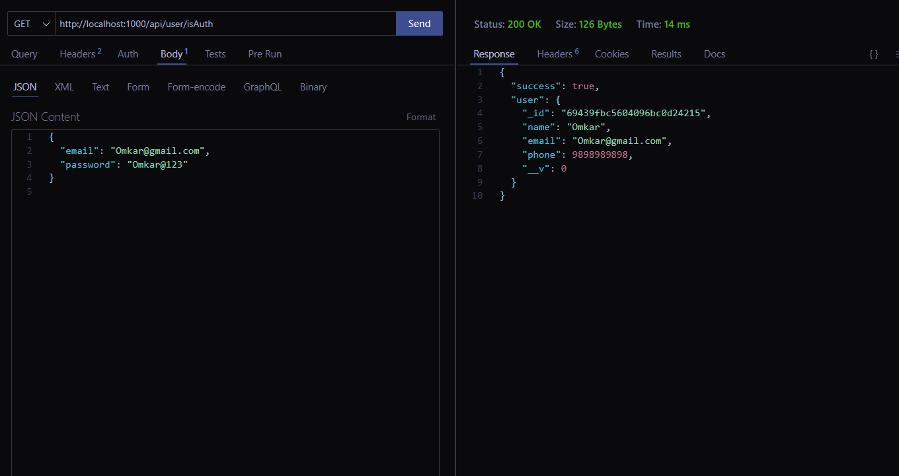
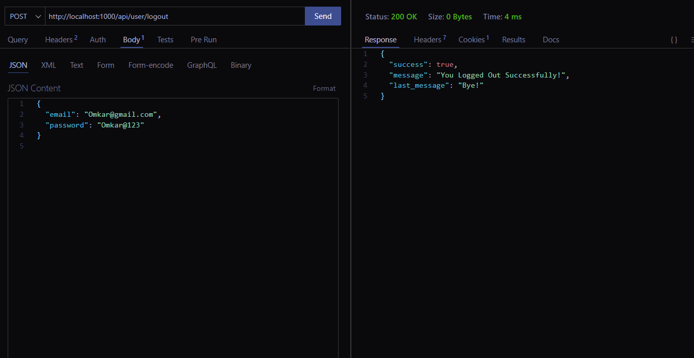

# User Authentication Backend API

A secure backend authentication system built using **Node.js, Express.js, MongoDB, JWT, and bcrypt**.
This project focuses on implementing **industry‑standard authentication practices** without a frontend.

---

## Features

* User Registration
* User Login
* Logout functionality
* Password hashing using **bcrypt**
* JWT‑based authentication
* HTTP‑only cookies for security
* Protected routes using middleware
* MongoDB database integration

---

## Tech Stack

* Node.js
* Express.js
* MongoDB
* Mongoose
* JSON Web Token (JWT)
* bcrypt
* cookie-parser
* dotenv

---

## API Endpoints

| Method | Endpoint             | Description                         |
| ------ | -------------------- | ----------------------------------- |
| POST   | `/api/user/register` | Register a new user                 |
| POST   | `/api/user/login`    | Login user                          |
| POST   | `/api/user/logout`   | Logout user                         |
| GET    | `/api/user/isAuth`   | User profile |

---

## Sample API Responses

### Register User

```json
{
  "success": true,
  "message": "You Registered Successfully!",
  "registered_user": {
    "name": "deon",
    "email": "deon@gmail.com",
    "phone": 8451209630,
    "password": "$2b$10$xpvn1Y3BtITgNvBSGS5mceKm7scWU4yi/0BlzHFMktvrLdAn./cIe",
    "_id": "6943a1fb5604096bc0d2421a",
    "__v": 0
  }
}
```

### Login User

```json
{
  "success": true,
  "message": "You Logged In Successfully!"
}
```

### isAuth User

```json
{
  "success": true,
  "user": {
    "_id": "6943a1fb5604096bc0d2421a",
    "name": "deon",
    "email": "deon@gmail.com",
    "phone": 8451209630,
    "__v": 0
  }
}
```

### Logout User

```json
{
  "success": true,
  "message": "You Logged Out Successfully!",
  "last_message": "Bye!"
}
```

---

## API Screenshots (Thunder)

>  **Note:** All screenshots are stored inside the `screenshots/` folder.

###  Register API



###  Login API



###  isAuth API



###  Logout API



---


##  Installation & Run

```bash
npm install
npm run dev
```

Server will start at:

```
http://localhost:1000
```

---

## Project Purpose

This project is built to:

* Demonstrate backend authentication skills
* Practice JWT & cookie‑based security
* Showcase backend‑only project on GitHub

---

##  Author

**Omkar Tale**
Backend / Full‑Stack Developer

---
